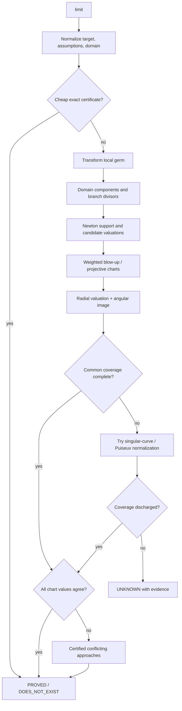

# Architecture

`asymptotic` is organized as cooperating symbolic layers instead of one monolithic expansion routine. The root package exposes only the primary workflow API; specialized structures live in their defining submodules.

## Core decision services

`context.py` centralizes normalization, zero equivalence, limits, eventual sign, and growth comparison. These operations are expensive and are cached per `AsymptoticContext`. `exprtest` is used as the proof-oriented nontrivial zero oracle with proof-cache reuse enabled; the context also memoizes requests under its own assumption policy.

`function_properties/` provides reviewed domain, singularity, analyticity, branch, extrema, and range information with tri-state decisions and provenance.

## Expression-to-expansion pipeline

A typical univariate path is:

```text
expression
  -> structural decomposition
  -> MRV / exp-log tower analysis
  -> scale discovery
  -> sparse continuation tree
  -> lazy multiseries
  -> nested/transseries representation
  -> truncation + remainder metadata
```

`decomposition.py`, `mrv.py`, `tower.py`, and `scale.py` establish structure. `sparse.py`, `frontier.py`, and `multiseries.py` perform demand-driven coefficient generation. `nested.py`, `monomial.py`, `logexp_transseries.py`, and `transseries.py` provide higher-level representations.

## Algebraic and inverse pipeline

```text
implicit/algebraic relation
  -> Newton support / dominant balance
  -> leading exponent + coefficient branches
  -> ramification / Puiseux lifting
  -> branch-aware reversion or implicit correction
  -> optional remainder theorem
```

The relevant modules are `puiseux.py`, `dominant.py`, `reversion.py`, and `implicit.py`.

## Multivariate pipeline

```text
multivariate relation
  -> parameter specialization
  -> Newton support
  -> weight-cone discovery
  -> chamber/wall representative scaling paths
  -> dominant balances
  -> joint implicit branch lifting
```

`multivariate.py` owns scaling paths and weight cones. `multivariate_implicit.py` lifts joint branches. Parameter-dependent deleted faces are handled through `parameter_auto.py` and `stratification.py`.

### Multivariate limit certification flow



The important soundness boundary is coverage: a finite set of paths can disprove
existence, but cannot prove a multivariate limit unless the chart/domain
certificate covers every admissible approach.

## Nonlinear ODE pipeline

```text
ODE residual
  -> differential dominant-balance terms
  -> parameter strata
  -> leading branch
  -> recursive algebraic/log/exponential corrections
  -> Frechet linearization
  -> bounded inverse/Green certification
  -> remainder/certificate object
```

`nonlinear_ode.py` performs formal lifting. `remainder_theorems.py` proves operation-specific estimates when possible. Constant-coefficient Green inverses are supplemented by a proof-bounded `L=L0+E(x)` path: normalize to monic form, prove coefficient convergence, certify a hyperbolic limiting dichotomy, replay the limiting Green particular in the full operator, and require a little-o defect plus a strict spectral-rate gap.

`_symbolic_policy.py` centralizes bounded symbolic fallbacks. Certification primitives, polynomial roots, small systems, limits, assumptions/SAT queries, and simplification all pass through explicit complexity budgets; callers must opt in to general SymPy solving/integration.

## Asymptotic differential fields

`asymptotic_field.py` implements moderate-growth and infinitesimal-ideal decisions, shadow/ghost decomposition, exponential extensions, and integral-shadow projection. It is a practical subset of Shackell-style asymptotic-domain machinery instead of a complete differential-algebra system.

## ODE integration boundary

`ode_adapter.py` is a structural interchange layer. `asymptotic` does not import `odeanalysis`; instead it consumes schema-like data and validates/replays constant-coefficient operator descriptors. This prevents circular dependencies and keeps certificates reproducible.

## Public API boundary

The root namespace is small. The full classification is documented in [api-classification.md](api-classification.md):

- **Primary root API:** stable workflows ordinary users should learn.
- **Expert submodule API:** public specialized/result/building-block objects imported from modules such as `asymptotic.dominant`.
- **Internal:** debugging/cache implementation details without stability guarantees.

Contract tests assert that expert/internal names do not leak back into the root package.

## Performance invariants

Four architectural rules prevent state-dependent degradation:

1. expensive decisions are cached at the smallest useful lifetime, usually an `AsymptoticContext`;
2. global caches are bounded and reserved for computations with high cross-context reuse (for example weight cones and characteristic polynomials);
3. theorem/certification code never launches an unrestricted symbolic search merely to decide whether a proof can be produced;
4. general SymPy solve/limit/assumptions/integration fallbacks are centralized and opt-in, while cheap exact algebraic routes are preferred.

Expression size alone does not bound polynomial expansion: a short power of a sum can produce thousands of terms. Structural expansion-width checks run before rational cancellation, polynomial conversion and general solving. The shared policy allows at most 4,096 estimated expansion terms; theorem-specific recognizers use smaller budgets. Operation counts and expansion width are separate limits because short factored expressions can still expand substantially. Budget exhaustion returns an unresolved result; it does not imply that an equation has no solutions. Two-sided scalar limits require agreement of both one-sided values.

These invariants are regression-tested alongside ordinary mathematical correctness.

## Common asymptotic-field protocol

`algebra.py` is the interoperability boundary between representations. It uses structural adaptation instead of inheritance:

```text
native object
   │
   ├─ TransseriesExpansion
   ├─ Multiseries
   ├─ NestedExpansion
   ├─ ScaleElement / Scale.element(i)
   ├─ ShadowField.element(expr)
   ├─ AsymptoticDifferentialField.element(expr)
   └─ NonlinearDifferentialTransseriesBranch
   │
   ▼
element(...)         AsymptoticAlgebra(x, point)
   │                              │
   └──────────────┬───────────────┘
                  ▼
           AsymptoticElement
   ├─ truncate / truncation / remainder
   ├─ differentiate / integrate
   ├─ compose / reciprocal / inverse
   ├─ compare
   ├─ + - * / **
   └─ to_transseries
```

A native method is always preferred when it exists. This is important: nested depth, multiseries coefficient recursion, shadow projection, and ODE lifting are not equivalent data models and should not be flattened merely to obtain a common class hierarchy. Finite transseries conversion is the interoperability fallback because transseries arithmetic already carries the package's strongest operation-level remainder propagation. Conversion and coercion live in `AsymptoticAlgebra`, so heterogeneous binary arithmetic, powers, division, comparison, composition, calculus, and inversion share one coordinate check and one finite normal-form policy.

The protocol also makes the remainder boundary explicit. A native object may represent its exact source expression while a finite truncation has a nonzero tail. `AsymptoticElement.remainder` therefore describes the native representation; `truncation(n).remainder` describes the finite prefix. `Multiseries.truncation()` certifies the first omitted active-scale term as a big-O tail. Nested structural depth is never treated as an additive term count; additive truncation of a nested object is requested through its transseries view.

## Singular implicit handoff

`implicit.py` separates *diagnosis* from *lifting*. `implicit_singularity_profile()` translates both the independent variable and dependent center to local zero coordinates, then checks the dependent Jacobian and successive dependent derivatives. A first nonzero derivative of order `m>1` certifies a multiple root; a vanishing dependent Jacobian with nonzero independent derivative certifies a turning point. Small polynomial problems also record a discriminant and candidate Newton scaling exponents.

`implicit()` attaches this profile to every branch. Multiple roots use the existing recursive dominant-balance engine explicitly as a Newton–Puiseux blow-up path. Parameter stratification receives derivative/discriminant structural expressions **after dependent-center translation**, so a condition such as `a=0` can switch a nonzero-centered branch from regular integer powers to ramified square-root branches. Unknown multiplicity stays unknown instead of being guessed.
## Certificates and replay

A certificate stores the concrete evidence used to justify a mathematical claim: identities, hypotheses, bounds, transformations, or operator defects. **Replay** means re-checking that stored evidence against the current symbolic objects without rerunning the original search that discovered it. Replay is therefore verification, not recomputation: a creative-telescoping certificate rechecks its telescoping identity; a remainder certificate rechecks its bound hypotheses; and a Green certificate rechecks the operator/right-inverse defect. A replay result of `True` verifies the stored evidence, `False` disproves it, and `None` means the verifier cannot decide from the retained information.

Search procedures and replay procedures are separate. Search may use heuristics, candidate enumeration, or bounded symbolic algorithms; replay should be deterministic, narrower, and cheap enough to use in tests and downstream certification.

## Source layout

The public namespace is defined in `_api_manifest.py`; implementation modules are grouped by mathematical responsibility even though most currently live in one package directory. The main dependency regions are:

- limits and multivariate geometry: `limits.py`, `multivariate_limits_advanced.py`, local-germ, cluster, parameter, projective, and stratification modules;
- expansions and asymptotic algebra: `algebra.py`, `multiseries.py`, `transseries.py`, scale, dominance, reversion, and Puiseux modules;
- discrete asymptotics: `sums.py`, `discrete_scale.py`, and recurrence modules;
- perturbation and differential equations: perturbation, multiple-scales, matched, and ODE modules;
- probability and Laplace asymptotics: `probability.py`, statistical transforms, and Laplace modules.

Shared limit results live in `limit_models.py`, normalization in `limit_primitives.py`, and the common coordinate-chart protocol in `chart_models.py`. Exact angular extrema are independent theorem primitives in `angular_extrema.py`; limit dispatch consumes these layers instead of owning them.

Some higher theorem providers still call back into limit dispatch for recursive subproblems, so the multivariate dependency component is not yet fully acyclic. Continue removing those callbacks before moving the modules into physical subpackages. File moves alone are not an architectural improvement: dependency direction and measured import/runtime behavior should be preserved or improved by any reorganization.
