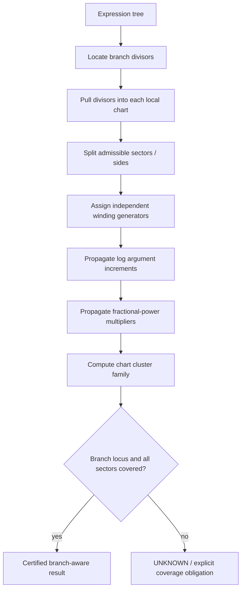

# Branches and local resolution

This guide collects the related mathematical mechanisms used by the multivariate limit engine. Public entry points are described in [Multivariate limits](../multivariate-limits.md).

## Branch-divisor and monodromy geometry

Complex branch analysis is represented by local branch divisors rather than
function-specific limit rules. `BranchDivisor` records the argument hitting a
principal cut, `MonodromyTransition` records the transition between its local
sides, and `ComplexBranchChart` attaches that data to the common
`BlowUpChart` geometry.

Boundary germs are propagated recursively through logarithms, arguments,
noninteger powers, arithmetic, and analytic outer compositions. This permits
nested branch expressions to inherit and, where appropriate, collapse inner
monodromy. Completeness is asserted only when the branched chart family has a
`CoverageCertificate`.

The current exact local model covers finite nonzero negative-real principal
cut collisions. Unsupported relative domains or unresolved branch structures
remain uncertified.

## Branch monodromy

Pulled branch divisors carry integer winding state. A turn contributes
`2*pi` to argument, `2*pi*I` to a logarithm, and
`exp(2*pi*I*n*alpha)` to a fractional power. Nested log/power expressions
propagate these states in expression-tree order. Repeated winding is retained
symbolically; a cluster family is declared finite only when the winding
parameter cancels.

## Branch-sensitive chart propagation

Independent pulled divisors retain independent winding generators.  Merely
enumerating open sectors does not certify completeness when the branch-point
accumulation locus itself has not been discharged.

## Recursive exceptional-divisor resolution

`resolve_exceptional_strata` recursively analyzes a weighted blow-up atlas.
A positive radial order is discharged uniformly. At radial order zero the
leading angular rational map is sent to the exact semialgebraic image engine.

Leading denominator-zero loci, common numerator/denominator zero loci and
angular critical loci become explicit `ExceptionalStratum` obligations.
Unresolved accumulating strata are represented by child `ResolutionNode`s.
A parent is complete only when its regular image is certified and every child
coverage obligation is discharged. A depth bound therefore yields PARTIAL,
never an inferred complete result.

This is the common recursive skeleton; local centers can be refined
for positive-dimensional smooth/singular strata without changing completeness
semantics.

## Recursive exceptional-stratum resolution

Exceptional strata are resolved by a finite Jacobian-minor atlas.  On each
smooth patch the independent constraint gradients define a tubular normal
chart.  The chart is executable by the same radial-initial and semialgebraic
image engine used by ordinary blow-up charts.

Polynomial coefficients of the transformed germ are reduced modulo the ideal
of the chart base equations before the normal radial order is selected.  This
is essential: a coefficient that vanishes identically on the exceptional
stratum must not be mistaken for a nonzero radial leading term merely because
its unreduced expression contains the symbolic base coordinates.

The common zero locus of the maximal Jacobian minors is not sampled.  It is
passed to semialg for a certified minimal-prime decomposition.  Each retained
real component carries its certified algebraic dimension.  Recursion into a
singular component is permitted only when that dimension is strictly smaller
than the parent dimension.  The resulting `DimensionDescentCertificate` is a
mathematical progress certificate; the recursion-depth bound remains only a
resource guard.

Coverage and image certification remain distinct.  A smooth atlas covers a
stratum geometrically only after every tubular chart has had its transformed
image discharged.  Likewise, dimension descent alone does not discharge a
singular remainder: every child atlas must recursively discharge its own
smooth and singular pieces.
