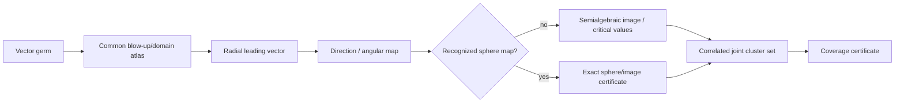

# Cluster sets and directional images

This guide collects the related mathematical mechanisms used by the multivariate limit engine. Public entry points are described in [Multivariate limits](../multivariate-limits.md).

## Cluster coverage invariant

A complete cluster result is certified only when its mathematical status is
`CERTIFIED` **and** it carries a complete `CoverageCertificate`.

Coverage is common across weighted blow-up atlases, Newton fans, projective
ends, semialgebraic domain components, branch sectors, phase tori, and
recursive local-stratum/frontier decompositions.  `PARTIAL` and `UNKNOWN`
coverage can carry useful local results but cannot prove a complete cluster set
or a nonexistence conclusion.

A static regression test scans every certified cluster-result constructor and
requires explicit `coverage=` provenance.  Runtime result properties also
refuse certification when coverage is absent or incomplete.

## Complex branch cluster geometry

Principal complex branches are analyzed by local branch charts instead of by
selecting one side of a branch divisor. `complex_branch_cluster_set`
currently certifies `log(z)`, `arg(z)`, and principal powers `z**a` at nonzero
negative-real targets.

The local atlas separates upper and lower half-plane approaches. For a full
complex approach its coverage certificate also accounts for the branch-cut
trace, so a non-singleton finite set is a complete cluster set instead of a
pair of sampled paths. For example, at `z -> -1`, principal `log(z)` has
cluster set `{I*pi, -I*pi}` and principal `sqrt(z)` has `{I, -I}`. Restricting
the domain to one certified half-plane gives the corresponding singleton.
Integer powers collapse the two branch charts to one value.

Unsupported branch functions or relative domains return an uncertified result.
This preserves the package rule that branch ambiguity cannot be resolved by
sampling or by an implicit branch convention.

## Discontinuous outer functions as cluster maps

A discontinuous outer function is evaluated from the *complete inner cluster
set*, not from a collection of paths. The cluster-map layer currently supports
`sign`, `floor`, `ceiling`, and fractional part on certified real finite sets
and intervals.

Discontinuity values and one-sided accumulation values are included in the
closed image. For example an interval crossing an integer maps under
fractional part to the closed cluster interval `[0,1]`, while an interval
crossing zero maps under `sign` to `{-1,0,1}`.

An incomplete inner cluster set can never certify the mapped cluster set.

## Extended complex monodromy clusters

Monodromy orbits are classified as finite cyclic, infinite discrete additive
translates, dense phase orbits, divergent branch-point orbits, or UNKNOWN.
Rational fractional powers give finite cyclic monodromy; logarithms give
integer translates by 2*pi*I; real irrational powers give dense phase orbits.
Classification is exact only when the corresponding algebraic/real assumptions
are certified.

## Joint vector geometry

The joint-cluster corpus covers vector-component disagreement, non-Cartesian joint
cluster sets, norm/direction maps on spheres, and higher-dimensional
anisotropic vector germs.

The global scalar dispatcher treats finite SymPy tuples componentwise for
limit existence: all components must be certified on the same domain; one
certified non-existent component proves the vector limit does not exist.
This rule is only about vector limits.  Joint cluster sets are never replaced
by Cartesian products of scalar cluster sets.

Direct joint-cluster tests exercise the existing correlated geometry engine:
the planar direction map has the unit circle as its complete joint cluster
set; squared directions retain the relation u+v=1; and a shared sine/cosine
phase has a circle, not a square, as its joint cluster set.

## Joint-cluster algorithm

Component cluster sets are never Cartesianized: all components are evaluated
over the same angular/domain parameter set, preserving correlations such as
`u**2 + v**2 = 1`.

## Parameter-aware cluster sets

Parameter stratification and cluster-set semantics are bidirectional.
Parameter complements are no longer automatically unresolved: each complement
is offered to parameter-aware cluster analyzers before falling back to UNKNOWN.
A certified cluster set is then converted through the same unified semantics
used by ordinary multivariate cluster analysis.

The first exact family covers

`P(u)/(u_1**2 + ... + u_n**2)**p`

when `P` is a nonzero homogeneous polynomial with nonnegative even monomials,
with both a positive angular direction and an exact zero direction. If
`p > degree(P)/2`, radial order is negative. A positive angular direction gives
unbounded cluster values, the zero direction gives zero, and continuity of the
angular image on the connected sphere supplies every sufficiently small
positive angular value. Coupling that angular value to the radial scale proves
the complete extended cluster set `[0, +oo]`.

For `x**16*y**22/(x**2+y**2)**p`, the exhaustive parameter result is therefore:

- `p < 19`: PROVED with value `0`;
- `p = 19`: DOES_NOT_EXIST after exact boundary specialization;
- `p > 19`: DOES_NOT_EXIST from the certified complete cluster set `[0,+oo]`.

There is no UNKNOWN stratum for this family. Value mode remains
`ConditionalExpression(0, p < 19)` because DNE strata do not have scalar
mathematical values.

The analyzer refuses sign-indefinite numerators, nonzero targets,
and relative domains until their cluster geometry has its own exact proof.

## Projective cluster-set decomposition

Bivariate homogeneous rational angular factors are represented on the real
projective line. The affine chart `[1:t]` is combined with the omitted point
`[0:1]`, including the sphere-normalization factor implied by the numerator and
denominator degrees.

For parameter-free rational projective geometry, the implementation computes
the exact real function range on every continuity component and closes the image
in the extended-real cluster topology. The result may therefore be a finite
union of points and intervals, including disconnected and unbounded sets.

The decomposition is complete only when the rational projective range solver
succeeds exactly. Unsupported symbolic-parameter topology is delegated to the
parameter-cell layer and is never replaced by path sampling.

## Signed and projective parameter-aware cluster geometry

Parameter-aware cluster analysis supports signed projective geometry in addition to nonnegative homogeneous families.

## Certified geometry

The parameter cluster layer separates a symbolic radial power from a
homogeneous projective angular factor and reasons about the latter exactly.
Supported proof families include:

- signed homogeneous even-polynomial angular factors;
- two-sided supercritical cluster sets (`Reals`) from certified positive and
  negative projective directions;
- positive and negative half-line cluster sets when an exact zero direction is
  present;
- diagonal quadratic angular forms, including parameter-dependent extrema;
- coefficient-order/sign refinement into additional parameter strata;
- disconnected critical projective images such as
  `1/(u**2-v**2)`, yielding `(-oo,-1] U [1,oo)`.

For a diagonal quadratic `(q*x**2 + y**2)/(x**2+y**2)**p`, the cluster layer
refines both parameters. At `p = 1`, it splits `q < 1`, `q = 1`, and
`q > 1`; the middle stratum has singleton cluster set `{1}`. At `p > 1`, it
splits by the sign of `q`, certifying `Reals`, `[0,+oo]`, or `{+oo}`.

## Bidirectional stratification

An exact parameter specialization is no longer accepted as a uniform generic
DNE result when other free parameters remain. Those remaining parameters are
returned to projective cluster analysis for refinement. Conversely, one
parameter cluster query may emit several refined strata; the general
parameter pipeline incorporates each independently through unified cluster-set
semantics.

This prevents generic-path conclusions from hiding exceptional parameter
values and makes parameter discovery and cluster geometry mutually refining.
