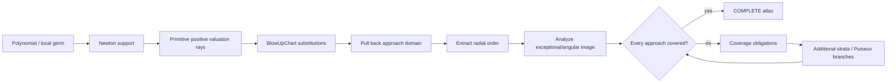

# Multivariate geometry

This guide collects the related mathematical mechanisms used by the multivariate limit engine. Public entry points are described in [Multivariate limits](../multivariate-limits.md).

## Angular parameter cells

Parameterized angular optimization refines parameter space whenever a symbolic
stationary point enters or leaves the angular simplex.

For an even bivariate homogeneous form, the sphere constraint is reduced by
`z = x**2`, `y**2 = 1-z`, with `0 <= z <= 1`. Stationary roots are solved
exactly. For a single real parameter, exact real-inequality elimination derives
the parameter condition under which each symbolic root lies in the simplex.
The resulting Boolean cells are exhaustive, and endpoint/interior critical
values are recomputed on each cell.

No parameter samples are used. If root membership cannot be eliminated exactly,
the optimizer remains uncertified instead of dropping the critical point.

## Blow-up and valuation geometry

Local multivariate geometry uses one common representation.

`Valuation` stores a positive integral weight ray and computes monomial and
polynomial valuations together with initial forms. `BlowUpChart` represents
the substitution `x_i = a_i + r**w_i*u_i`, its exceptional divisor, angular
constraint, and optional sector. `BlowUpAtlas` records a finite chart family
and its coverage certificate.

Ordinary polar analysis is the weight `(1,...,1)` case. Weighted asymptotic
expansion uses the same chart construction with arbitrary positive weights.
Newton fan representative rays are lifted to the same weighted atlases.
Bivariate affine projective charts are the `(1,1)` blow-up with one angular
coordinate normalized to one.

This keeps radial, weighted, Newton and projective reasoning on the same
valuation/chart vocabulary. A chart is complete only when its atlas carries
an explicit coverage certificate; individual paths do not imply completeness.

## Chart construction and certification

Weighted, ordinary radial, Newton, and projective analyses meet at
the same `Valuation`/`BlowUpChart` abstraction.  Symbolic weights remain
symbolic until positivity and the required ordering relations are certified.

## Inequality-aware tubular and branch geometry

A smooth-stratum tubular base retains the complete semialgebraic stratum
condition, including closed inequalities from wedges, sectors, Piecewise
regions and branch sides. Angular images therefore pass these restrictions to
`semialg.function_range`, whose KKT active-set backend can certify compact
polynomial images on closed basic semialgebraic sets.

`branched_blowup_atlas` detects nested principal log, arg and noninteger-power
operations, pulls each argument through every blow-up chart, records the
principal-cut and branch-point equations, intersects them with the pulled
relative domain, and constructs a finite sign-sector cover. Nested operations
therefore use one geometric atlas instead of function-specific coordinate
recognizers.

## Local-germ algebra

`LocalAsymptoticGerm` represents leading data of the form

    r**alpha * log(r)**beta * log(abs(log(r)))**gamma * A(u).

Orders form the additive `GermOrder` algebra. Products, quotients, powers,
conjugation, real/imaginary parts and radial differentiation operate directly
on germ objects. `ComplexLocalGerm` supplies the corresponding
`z**alpha * log(z)**k * A(u)` representation with a branch index.

Special functions enter through registered germ data. The initial registry
contains the small-argument Bessel-J rule; additional Bessel/Hankel data can
be registered without adding special cases to the limit frontend.

## Projective and local-germ global integration

## Infinite targets

`limit` recognizes real `+oo`/`-oo` target coordinates before
finite-target normalization and dispatches through `projective_limit_chart`.
Each infinite coordinate is replaced by a reciprocal coordinate tending to
zero with the correct one-sided sign condition.  The ordinary finite-target
proof engine then handles the transformed germ.

This dispatch reuses the projective-geometry implementation.

## Registered local germs

A proof-bounded global lift handles registered first-order local germs of
the form `f(u)/v`.  It requires independent certificates that `u -> 0` and
`u/v -> L`, then returns the registered leading coefficient times `L`.
Equal registered first-order germs can also cancel when the quotient is by the
common inner germ.

The lift covers erf/erfi cases, including nested
`erf(sin(u))/u`.  It does not turn every registered germ into a
global result: negative orders, branch-sensitive germs, and Bessel-Y logarithmic
singularities still require sign/branch/domain-specific composition rules.

## Higher-dimensional projective blow-up atlas

`projective_blowup_atlas` constructs the standard affine cover of real
projective direction space RP^(n-1). Chart i fixes angular coordinate i to
one; every ordered chart overlap has an exact rational `ProjectiveTransition`.
The atlas carries a complete `CoverageCertificate`, because every nonzero
direction has at least one nonzero coordinate.

The older RP^1 rational-range decomposition remains a specialized fast exact
solver. Higher-dimensional algorithms consume the same `BlowUpChart` objects.

## Semialgebraic angular images

`semialgebraic_angular_image` is the general exact fallback for rational
functions on an exceptional divisor. It constructs the exact graph, intersects
it with the transformed angular/domain constraints, and existentially projects
source coordinates using `semialg`.

Specialized eigenvalue and bivariate simplex solvers run first. QE/CAD is used
only when those cheap certificates do not apply. Unsupported projections
remain UNKNOWN; numerical extrema never become completeness certificates.

## Smooth-stratum atlases and singular loci

Exceptional algebraic strata are split by Jacobian rank.  If the generic
Jacobian rank is `r`, every nonzero `r x r` minor defines a smooth open patch.
These finitely many patches cover the entire rank-`r` locus by construction.
Their common zero set is retained separately as the Jacobian rank-drop locus.

Each smooth patch carries a tubular normal blow-up whose base point remains a
symbolic point of the stratum.  Independent constraint gradients on the patch
form a normal frame, and the normal displacement is scaled by a new positive
radial variable.  This avoids replacing a positive-dimensional stratum by a
single sampled center.

The rank-drop locus is recursively stratified by the same construction.  A
geometric atlas certificate proves coverage of the stratum; it does not by
itself prove the asymptotic image on every tubular chart.  Those are separate
coverage obligations and remain unresolved until their limit/cluster images
are certified.

## Stratum-centered recursive resolution

Recursive resolution attempts to build an exact local model of each
exceptional stratum before creating a child blow-up. An exact real point is
selected, the Jacobian of the defining equations is evaluated there, and its
nullspace/column space provide tangent and normal directions.

For a certified smooth complete-intersection point the local substitution is

    u = p + T tau + rho N nu,

so only normal directions are blown up while tangent coordinates remain along
the stratum. A single local center does not certify coverage of a
positive-dimensional stratum; it remains a coverage obligation until an atlas
of such local models covers the whole accumulating stratum.

## Unified local chart protocol

Weighted spherical/Newton charts, affine projective charts, reciprocal end
charts, tubular exceptional-stratum charts, and branched charts share the
same transformation/domain protocol: `transform`, `pullback_domain`, and
`exceptional_domain`. `CoordinateChart` replaces the separate projective-end
representation through the `CoordinateChart` interface.

Domain-relative inequalities are pulled through tubular substitutions and are
retained on the exceptional divisor. Branch geometry enriches the same base
charts with pulled principal-cut divisors and finite sign sectors rather than
maintaining a separate coordinate system.

## Valuation and chart engine

`Valuation`, `BlowUpChart`, and `CoverageCertificate` are the common local
geometry vocabulary for multivariate limits and cluster sets.

Weighted polynomial order and initial-form calculations delegate to
`Valuation`. Coordinate monomial orders used by complex normal-crossing
analysis are computed by the same object. Weighted angular maps and radial
leading values are obtained from `BlowUpChart` transformations. Candidate
Newton rays live in `blowup_geometry`, while complete Newton-fan rays are
returned together with a `CoverageCertificate` by
`newton_valuation_rays`.

Consequently the weighted-limit atlas, scalar/vector Newton cluster engines,
joint cluster geometry, and complex branch atlas all use the same notion of
finite chart completeness. A collection of successful charts is not promoted
to a complete limit or cluster result unless its common coverage certificate
is certified.
